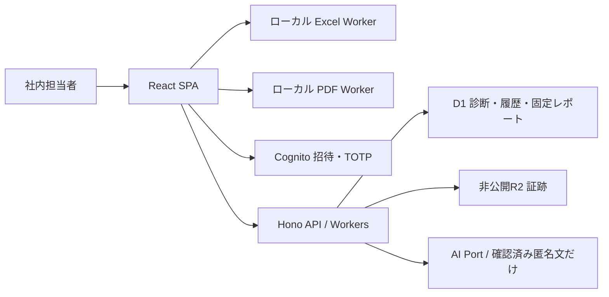

<!-- product-mode: webapp -->
# SCS Assessment 設計書

- 種別: 横断設計書 / 2026-09-18
- 保存先: [yasagure3/SCS_Assessment](https://github.com/yasagure3/SCS_Assessment)
- 状態: UIスケッチ・設計レビュー完了。GitHub登録済み、F01からローカル製造を開始。
- 要件の正本: [ヒアリング](REQUIREMENTS_INTERVIEW.md)、[ユースケース](USECASES.md)。外観は [UIスケッチ](UI_SKETCH.html)、技術検証は [FEASIBILITY.md](FEASIBILITY.md)。

## 目的とスコープ

社内担当者が複数顧客のSCS ★3取得に向けた課題を整理し、根拠を確認し、具体的な改善策と経営層向け報告書を提供する。初回は2026-03-27版の★3（26要求事項・81評価基準）。制度の正式審査や取得の自動判定は行わない。

Excel取込、現状集計、回答編集、証跡管理、定型助言と任意のAI案、担当者による助言確定、改善課題、再診断比較、PDF・作業用Excel出力、招待・MFAを含む。顧客はレポート受領者でありログインしない。★4、回答への再取込マージ、制度改訂の自動移行、監査履歴の全件検索画面は次段階。

資料内の文章・セル・AI出力は処理対象データとして扱う。命令、権限変更、外部送信の承認として解釈しない。

## アーキテクチャと技術選定

指定の `skanehira/fullstack-worker-template`、コミット `fab841832525a39d13b0c259336fc4b28fc37f0a` を基盤にする。参照cloneは `.reference/` に隔離し、基盤タスクで必要ファイルをルートへ展開する。出典と原READMEを保持する。取得版に独立LICENSEファイルはないため独自にMITを付与せず、公開配布前のNOTICE確認事項に含める。既存の設計・PoC・Git履歴を上書きしない。



| 要素 | 選定・用途 |
|---|---|
| SPA | テンプレートのReact 19 / React Router / SWR / Tailwind。白・紺・青の承認済み外観。データ取得はSWR、`useEffect` import禁止を維持 |
| API | Hono / Workers。domain → Port、usecase → domain、adapter → usecase/domainの依存を守り、composition rootでDI |
| 永続化候補 | D1 + Drizzle。1診断81基準をサイズ制限したJSON集約としてCAS更新し、履歴を残す。ファイル本文は別の非公開R2 |
| 認証候補 | テンプレートのCognitoを招待限定・必須TOTPに修正。社内権限はD1で毎回確認 |
| Excel | ExcelJS 4.4.0を遅延読込。専用Web Workerで解析/書出し。ブラウザ試験199 assertions成功。サーバーでも正規化結果を再検証 |
| PDF | pdf-lib 1.17.1 / fontkit 1.1.1 / Noto Sans CJK JP 2.004。検証済み全量フォント埋込みをWorkerで実行。日本語の全文・ページ画像の両方を検証 |
| AI | OpenAI Responses / 候補 `gpt-6-sol`、標準処理。固定adapterと永続予算を実装し、既定は無効。月$20、初回匿名試験は累計$5/30回。実モデル利用可否・接続は#27で検証。ローカルはfake HTTPのみ |

`src/front` と `src/server` の直接importは禁止。Zodの入出力契約・純粋な列挙型は `src/shared/contracts/`。UIからdomainを直接importせず、公式マスター/集計結果はAPI経由とする。Excel/PDFの純粋な変換は `src/front/workers/`、API側の判定は `src/server/modules/assessment/domain/` に置く。

### 保存先の提案（Q14への回答）

第一案はテンプレートに沿ったWorkers/D1/R2＋Cognito。構成を小さく保て、当初の実装を進めやすい。D1/R2のlocation hintは国内限定保存の保証ではないため、国内限定が必要ならこの案を確定しない。代替は国内リージョンのDB/オブジェクト保管＋認証で、Portを維持してadapterと運用設計を見直す。代替の実機検証・見積は本設計の完了範囲外。

2026-09-24、ユーザーはCloudflareの匿名データ用検証環境への初回公開を承認した。Issue #43の手順は [PREVIEW_OPERATIONS.md](../PREVIEW_OPERATIONS.md)。本番のリソース作成、実顧客データ保存、AI実送信は「未解決の論点」の確定後。

## 開発・検証コマンド

### 現時点で実行済み

ルートへ指定テンプレートを展開済み。以下はPoCの実測コマンド。アプリ基盤の検証結果はF01完了時に追記する。依存・固定配布物の取得手順は各README。

```powershell
node poc/excel/verify-anonymous.cjs
node --test poc/domain/boundaries.test.mjs
python poc/domain/check_sqlite.py
```

PDFは `poc/report` を作業ディレクトリとし `./bootstrap.ps1`、`node build.mjs`、`node test.mjs`、`python verify.py`。Pythonは3.11以降＋pdfplumber、Popplerが必要。当該PCではバンドルruntimeのPythonを`-X utf8`で使用。結果と限界はFEASIBILITY.md参照。

### アプリ基盤の検証コマンド

2026-09-18、Windows/Node 24.21.0/Vite+ 0.2.4/pnpm 11.2.2で、下記の依存固定・型・lint・ビルド・Front 10件・Workers 9件・local migration・E2E 1件が成功した。ブラウザ実測はMicrosoft Edgeを使用。ポート競合時の起動拒否も成功。さらにコミット `c417780` の新しいcheckout（独立したnode_modules/ローカルDB、ポート5183）で全コマンドを再実行して成功した。Windowsのautocrlfによる差分は `.gitattributes` で解消。手順は [DEVELOPMENT.md](../DEVELOPMENT.md)。

| 用途 | コマンド |
|---|---|
| 依存 | 固定版Vite+を導入後 `vp install --frozen-lockfile` |
| 型生成 | binding変更時 `vp exec wrangler types` |
| ローカルDB | `vp exec wrangler d1 migrations apply scs-assessment-db --local` |
| 起動 | `vp dev --port 5173 --strictPort`。別worktreeは別ポートを必ず指定 |
| Frontテスト | `vp test --run` |
| APIテスト | `vp exec vitest run -c vitest.workers.config.ts` |
| 静的検証/ビルド | `vp check`、`vp build` |
| E2E導入 | `vp exec playwright install chromium`。既存Edgeでは `E2E_CHANNEL=msedge` を使用可 |
| E2E実行 | `E2E_PORT=5181` を設定後 `vp exec playwright test tests/e2e/smoke.spec.ts` |
| ポート競合 | `vp exec node scripts/check-port-conflict.mjs` |

新しいworktreeでは依存をインストールし、`.dev.vars.example` / `.env.local.example`を参照してローカルD1へmigrationを適用する。認証未設定での検証はenvファイルのコピー不要。匿名seedはF02以降のテストで用意する。実秘密をworktree間で自動コピーしない。`.worktreeinclude`は非秘密の設定例だけを対象にする。ポートを `E2E_PORT` 環境変数で注入し、PlaywrightのwebServerは `reuseExistingServer:false`、`--strictPort`。既存サーバーへ相乗りしない。

認証fakeはテスト専用compositionで注入し、production bundleや環境変数だけで有効化できる迂回ログインを作らない。Cognito motoはパスワード署名を検証しないため、本番MFAの合格根拠にはしない。Frontはjsdom、APIは `test/worker/` のWorkersランナーを分離する。Cognito実機試験は最後の接続検証に分ける。

## データスキーマ

F02検証（2026-09-18）: 固定81基準/26要求事項とcontent hash、seed再適用、同版の並行更新、通常/no-opの共通キー競合、途中失敗時の全取消、履歴/原値/レポートの不変性、1MiB/1.5MiB上限、他顧客/案件の関連拒否を含む19件がWorkers poolで成功。全体ではFront 10件、Workers 28件、ブラウザ1件、ポート競合拒否、型/lint/ビルド、ローカルDBの全migrationが成功。API・画面からの利用は後続タスクで接続する。

全IDはサーバー採番UUID、JSONはschemaVersion付き、時刻はサーバーUTCのISO8601、日付は`YYYY-MM-DD`。期限超過の表示はJSTの当日で比較。IDの辞書順を時系列に使わない。TEXT長・JSON byte数をAPIで検査し、DBにもCHECK/UNIQUE/FKを置く。FKを有効にし、顧客/案件をまたぐ関連は複合FK又は書込時の対応検証で拒否する。

| テーブル | 主要カラム・制約 | インデックス/用途 |
|---|---|---|
| app_users | id PK, cognito_sub UNIQUE nullable, email_normalized UNIQUE, role admin/staff, status invited/active/suspended, revoked_before, revision INTEGER, created_at, updated_at | status/role。メールは認証用のみ、subを本人のキーとする |
| auth_revocations | id PK, user_id FK, revoked_before, status pending/processing/succeeded/failed, error_code, request_id, created_at, updated_at | アプリ失効を先に確定するoutbox。provider呼出しは一度だけclaimし、tokenは保存しない |
| customer_memberships | customer_id FK, user_id FK, PK(customer_id,user_id), created_by, created_at | user_id/customer_id、割当確認 |
| customers | id PK, name TEXT(200), archived_at nullable, revision, created_by, created_at, updated_at | name/id、許可済み一覧検索 |
| cases | id PK, customer_id FK, name TEXT(200), archived_at nullable, revision, created_by, created_at, updated_at | customer_id/updated_at/id |
| standards | id PK (`scs-20260327-star3`), publication_date, level=3, source_url, source_sha256, content_sha256, expected_count=81, sealed_at | 公開原文マスター。sealed後UPDATE/DELETE禁止 |
| criteria | standard_id FK, criterion_id TEXT, requirement_id, category, order_no, official_text, source_row, PK(standard_id,criterion_id), UNIQUE(standard_id,order_no) | 81基準を固定順で列挙 |
| advice_templates | id PK, standard_id/criterion_id FK, version, gap, steps JSON, evidence_examples JSON, completion_check, source_urls JSON, content_sha256, sealed_at | 基準/版。公開要件と当社の実施例を区別し、発行版は不変 |
| assessments | id PK, case_id FK, customer_id FK, standard_id FK, previous_assessment_id nullable FK, revision INTEGER>=1, document_json TEXT, mutation_id, request_hash, actor_id FK, created_at, updated_at | case_id/created_at/id、customer_id。JSON UTF8<=1MiB |
| assessment_revisions | assessment_id FK, revision, document_json, mutation_id, request_hash, actor_id, created_at, PK(assessment_id,revision), UNIQUE(actor_id,mutation_id) | INSERT/UPDATE triggerで全版を保存。UPDATE/DELETE禁止 |
| files | id PK, customer_id/case_id FK, object_key UNIQUE, original_name, mime, size_bytes, sha256, status uploading/ready/rejected, created_by, created_at | case_id/status。R2キーはサーバー採番、名前と別 |
| reports | id PK, assessment_id/customer_id FK, assessment_revision, snapshot_json TEXT, snapshot_sha256, schema_version, renderer_version, created_by, created_at | assessment_id/created_at/id。UTF8<=1.5MiB、UPDATE/DELETE禁止 |
| invitations | id PK, user_id FK, status pending/processing/sent/failed/expired, expires_at, provider_request_id nullable, last_error_code nullable, attempt_id nullable, processing_started_at nullable, created_by, created_at | user_id/status。仮パスワードやメール本文は保管しない。attemptは同時retryと古い完了結果を排除 |
| ai_runs | id PK, assessment_id, criterion_id, input_hash, basis_hash, status pending/running/succeeded/failed/stale, provider_model nullable, draft_json nullable, requested_by, created_at | assessment_id/created_at。生の入力/プロンプトをログへ残さない |
| ai_budget_reservations | run_id PK/FK ai_runs, utc_month, mode trial/monthly, reserved_cents=10, model=gpt-6-sol, created_at | 月次$20と試験累計$5/30回を外部HTTP前に原子的予約。追記のみ、成功/失敗/不明でも返還しない。入力・キー・HTTP応答本文は保存しない |
| operation_receipts | actor_id, operation_key, request_hash, resource_id, reservation_id UNIQUE, response_json, created_at, PK(actor_id,operation_key) | 全更新の共通冪等キー台帳。通常更新と成功no-opを同じUNIQUEで排他する。reservation_idはサーバーが各試行で新規採番 |
| audit_events | id PK, actor_id, customer_id nullable, action, resource_type/id, from_revision nullable, to_revision nullable, request_id, created_at | resource_type/id/created_at。本文・token・証跡URLは含めない |

1MiB=1,048,576 bytes。JSON全文の保管は小さい診断単位で原子性と履歴の再現性を優先した判断。項目横断の全文検索は初回に含めない。customer_idの複製値はcaseから導出し、body指定を信用しない。

### 診断documentの共通型

```typescript
type Status = 'yes' | 'uncertain' | 'no' | 'unanswered'; // ○ / △ / ✖ / 未回答
type Review = {state:'unreviewed'|'confirmed'|'rejected'; note:string;
  by:string|null; at:string|null; subjectHash:string|null};
type AssessmentDocument = {
  schemaVersion:1; diagnosisDate:string|null;
  copiedFrom:null|{assessmentId:string;revision:number};
  scope:{companies:string;sites:string;departments:string;systems:string};
  importInfo:null|{fileName:string;clientFileSha256:string;normalizedSha256:string;
    importedAt:string;importedBy:string;star4Excluded:number;missingIds:string[]};
  responses:Record<string,Response>; evidence:Evidence[]; tasks:Task[];
};
type Response = {
  original:null|{sheet:string;row:number;O:string;P:string;Q:string;R:string};
  status:Status; reason:string; basis:string; plannedWork:string; supplement:string;
  manualEdited:boolean; adviceBasisVersion:number; basisHash:string;
  adviceDraft:Advice|null; confirmedAdvice:ConfirmedAdvice|null;
};
type Advice = {origin:'template'|'manual'|'ai'; templateId:string|null;
  gap:string;steps:string[];evidenceExamples:string[];completionCheck:string;notes:string};
type ConfirmedAdvice = {content:Advice; basisHash:string;by:string;at:string;version:number};
type Evidence = {id:string;criterionIds:string[];name:string;url:string|null;
  location:string;fileId:string|null;reviews:Record<string,Review>};
type Task = {id:string;sourceTaskId:string|null;sourceAssessmentId:string|null;
  criterionId:string;title:string;ownerName:string;dueDate:string;
  priority:'high'|'normal'|'low';state:'todo'|'doing'|'awaiting_review'|'done';
  completionCondition:string;result:string;evidenceIds:string[];review:Review};
```

responsesのキーは制度マスターの81 IDと完全一致。originalは初回取込後不変。未取込行はnullで、再診断コピーはsourceへの参照を `previous_assessment_id` と履歴で辿る。新しい診断のoriginalはnull、コピー値は編集値として扱う。source_rowとimport元rowを混同しない。

Reviewのby/at/hash、basisHash、確認版はサーバー計算。basisHashは制度版/基準、scope、自己評価と理由/根拠/作業/補足、当該基準に関係する証跡と確認状態、adviceBasisVersionを正規化してSHA-256。adviceBasisVersionは初期1、これらの内容が変わるたび単調増加させる。文言を以前の値へ戻しても古い確定助言/AI確認が再有効化しない。タスクの担当/期限/進捗は含めない。対応する変更で一致しなくなった確定助言は再確認対象。diagnosisDateだけの変更は助言を無効化しない。evidenceの変更は関連する全基準へ作用する。

### トランザクション境界

| 操作 | 原子的に成立する内容 |
|---|---|
| 診断編集/取込/証跡リンク/課題/助言確定 | expectedRevisionでCASする1行更新。履歴triggerと監査を同じD1 batchへ。0行更新は409、履歴や成功receiptを作らない |
| 顧客/案件/再診断作成 | 親子と作成者割当/初期81行/操作receiptをD1 batchで一括。途中失敗は全体rollback |
| レポート確定 | expectedRevisionとscopeを条件にINSERT SELECTし、その時点のdocumentを含むsnapshotを固定。監査/receiptと一括。診断が変わっていれば409 |
| 管理者/割当変更 | ユーザー又は顧客revisionのCAS＋割当差分＋監査。最後のactive管理者を失わせる変更は同一batch内条件で拒否 |
| 外部R2/Cognito/AI | DBと分散transactionは組まない。状態を先に予約→外部処理→結果確定。中断状態を可視化し同じ操作IDで回復。失敗を成功扱いしない |
| OpenAI費用予約 | 新規running runだけに、月次/試験上限とrun重複を条件に1回10セントを単一INSERT SELECT。DB成功後だけHTTPを開始。中断・送信結果不明でも予約は不変。古いrun/receiptは再予約しない |

D1 batchの原子性は公式資料とローカルWorkers試験で確認済みだがremote実測は接続検証に残す。全更新・成功no-opでoperation_receiptsを共通のキー台帳にする。最初にreceiptを検索してhash一致なら保存結果を返し、不一致は409。書込batchでは、expectedRevisionと全業務条件を満たす場合だけreceiptをINSERT SELECTし、今回の試行に固有なreservation_idと前提revisionを条件に本体/監査を書き換える。既存の同key/hashのreceiptが並行処理で作成されても、今回の予約が0行なら後続書込は全て0行となる。0行又は同keyの一意制約競合時は台帳を再読込し、同hashの確定結果があればそれを返し、なければ409。途中のエラーは本体/履歴/receipt/監査を全rollbackする。historyのmutation_idは追跡/整合検査にも残すが排他の正本は共通台帳。異なるkeyによる旧版更新はCASで拒否する。

request_hashはHTTP method・正規化path・認可されたresource ID・body（mutationIdを除く）のcanonical SHA-256。成功no-opもexpectedRevisionを条件にreceiptを保存し、診断revisionは増やさず再送時は保存時の結果を返す。競合の0行と成功no-opを混同しない。レポート等の作成は新resource IDを先に生成し同じbatchに固定する。

ファイルreadyになるまでEvidenceに関連付けない。失敗したuploadを参照して確認済にしない。物理削除は保持条件確定後の運用機能とし、初回はarchive/関連解除のみ。旧レポート/履歴が参照するオブジェクトは残す。

Migrationは連番SQLをcommitし既存ファイルを後から書き換えない。初期マスターは公開原文だけをseedしcontent hashを検証。新制度版は追加行として導入し旧診断を勝手に移行しない。更新前バックアップと復元リハーサルは出荷条件。

## API 一覧

全パスの接頭辞は `/api/v1`。個別DTO/振る舞いは右欄の機能設計が正本。`a`はassessmentId、`c`はcustomerId、`k`はcaseId。以下の略記は実装時にパラメーター名へ展開する。

| Method / Path | 概要 | 機能設計 |
|---|---|---|
| GET /me | 有効ユーザーと権限 | [access](features/access.md) |
| GET/POST /users/invitations | 招待一覧/予約と発行 | access |
| POST /users/invitations/:id/retry | 失敗/期限切れ招待の再発行 | access |
| GET /users | 管理者用社内ユーザー一覧 | access |
| PATCH /users/:id | 停止/役割変更 | access |
| PUT /customers/:c/members | 割当の置換 | access |
| POST /session/revoke | 自分の全セッション失効 | access |
| GET/POST /customers | 許可顧客の一覧/追加 | [cases](features/cases.md) |
| PATCH /customers/:c | 名称/アーカイブ | cases |
| GET/POST /customers/:c/cases | 案件一覧/初期診断つき追加 | cases |
| PATCH /cases/:k | 案件名/アーカイブ | cases |
| GET /cases/:k/assessments | 診断時点一覧 | cases |
| PATCH /assessments/:a/scope | 範囲/診断日変更 | cases |
| GET /standards/:id | 公開基準と版情報（ログイン要） | [assessments](features/assessments.md) |
| GET /assessments/:a | 全81回答・集計・証跡・課題・版 | assessments |
| PATCH /assessments/:a/responses/:criterionId | 自己評価と編集文の変更 | assessments |
| POST /assessments/:a/imports/preview | 正規化JSON再検証/確認票 | [imports](features/imports.md) |
| POST /assessments/:a/imports | 検査済み内容の一括確定 | imports |
| POST /cases/:k/files | 非公開ファイルのbinaryアップロード | [evidence](features/evidence.md) |
| GET /files/:id | 状態/メタデータ | evidence |
| GET /files/:id/content | 認可付きattachmentダウンロード | evidence |
| POST /files/:id/rescan | 管理者の明示的再検査・冪等予約 | evidence |
| POST /assessments/:a/evidence | 証跡追加 | evidence |
| PATCH/DELETE /assessments/:a/evidence/:id | 編集/関連解除 | evidence |
| POST /assessments/:a/evidence/:id/reviews/:criterionId | 基準ごとの確認結果 | evidence |
| GET /standards/:id/advice-templates | 版固定の定型助言 | [advice](features/advice.md) |
| PUT /assessments/:a/advice/:criterionId/draft | 手動/定型下書き保存 | advice |
| POST /assessments/:a/advice/:criterionId/confirm | 人による確定 | advice |
| POST /assessments/:a/advice/:criterionId/ai-runs | 匿名化確認＋生成要求 | advice |
| GET /assessments/:a/ai-runs/:id | 生成状態/結果 | advice |
| POST /assessments/:a/advice/:criterionId/adopt-ai | AI結果を下書きへ採用 | advice |
| POST /assessments/:a/tasks | 改善課題の追加 | [improvement](features/improvement.md) |
| PATCH /assessments/:a/tasks/:id | 課題の編集/進捗 | improvement |
| POST /assessments/:a/tasks/:id/review | 完了確認/差戻し | improvement |
| POST /cases/:k/reassessments | 前回参照/コピーで再診断 | improvement |
| GET /assessments/:a/comparison?previous=:id | 同一案件の比較 | improvement |
| POST /assessments/:a/report-preview | 出力前検査/内容確認 | [reports](features/reports.md) |
| POST /assessments/:a/reports | 不変snapshotの確定 | reports |
| GET /assessments/:a/reports | 既存レポート版一覧 | reports |
| GET /reports/:id | 再出力用snapshot | reports |

## 横断規約

### 認証と認可

Cognitoの公開自己登録を無効化し、MFAをOPTIONALではなくON、TOTPを必須にする。API/SRPによる管理者招待ユーザーのNEW_PASSWORD_REQUIRED → MFA_SETUP → SOFTWARE_TOKEN_MFAを完了させる。クライアント申告のmfaCompleteは受け付けない。署名/JWKS、alg、issuer、token_use=access、client_id、sub、exp、iat/auth_timeの型と値を検証する。有効なpool設定が必須で、JWT検証単体をMFAの代わりにしない。

全データAPIでactive app_userと顧客権限を検査する。管理者は全顧客、staffは割当顧客のみ（Q11の設計前提）。停止/割当解除後の新しいAPI要求は既存tokenでも拒否。JWT検証だけではCognitoの失効を検出できないため、`auth_time <= revoked_before`も拒否する。回復操作ではまずapp_userを停止、全セッション失効してから本人確認・TOTP再設定を行い、再有効化する。

Access/refresh tokenはブラウザメモリにだけ保持し、SDKのStorageも置換する。初回はリロード後の再ログインを許容し、localStorage/URLにtokenを残さない。APIは同一originのBearer、CORSは既定不許可。通信・出力はHTTPS、本番レスポンスはCache-Control:no-store。認証失敗401、存在を秘匿する他顧客リソース404、管理者操作の権限不足403。UI非表示だけで認可した扱いにしない。

### API・競合・監査

成功は `{data, requestId}`、一覧は `{data:{items,nextCursor},requestId}`。エラーは `{error:{code,message,fields?:[{path,reason}],currentRevision?:number},requestId}`。自由記述をエラーログにコピーしない。400 malformed、401/403/404、409 conflict/idempotency、413 size、422 validation、429 rate、502/503 provider failure、504 provider timeout。

更新系は `{expectedRevision, mutationId, ...fields}`、作成系は `Idempotency-Key` 必須。POST previewや照会に副作用はなくkey不要。削除もbodyの同じ更新契約を用いる。サーバー所有のID/hash/時刻/確認者はbodyから設定不可。Zodは未知フィールドを拒否する。文字数はUnicode codepoint、byte制限はUTF8。入力HTML/AI Markdownは文字列として表示し、raw HTMLを実行しない。

競合は編集内容をメモリに残し最新の版を取得して項目差分を提示。自動merge/自動再送しない。利用者が再編集して別mutationIdで保存。ネットワーク不明時の同一body再試行は同じID。ログアウト時に編集中内容とSWRキャッシュを破棄する。

ログはrequestId・動作・時間・結果codeのみ。顧客回答、証跡本文/URL、AI入力出力、token、キーを出さない。監査はDBの版とactorを参照する。API利用件数制御は利用者と操作別、AIは同時1件/利用者・1分5回を初期設定とし、429で待ち時間を返す。外部呼出しは有限timeout、勝手な無制限再試行をしない。

### 上限とUI共通動作

| 対象 | 初期上限/振る舞い |
|---|---|
| テキスト | 名前200、URL2048（https/httpのみ）、scope各2000、回答編集文各8000、助言合計12000 codepoints。raw O〜Rも各8000。診断全体1MiBを優先し超過を保存前表示 |
| 配列 | 証跡100件/診断、課題100件/診断、1証跡の関連先は同版81基準内。ページ一覧50件、最大100件、cursorは権限付きで再検証 |
| ファイル | 10MiB/件、PDF/PNG/JPEG/TXT/DOCX/XLSX。拡張子と実形式の整合。HTML/SVG/実行形式/マクロ/暗号化文書を拒否 |
| xlsx検査 | 10MiB input、500 ZIP entries、実展開合計50MiB/1entry10MiB、5 sheets、2000rows×64cols、100000非空cells、ZIP64/暗号化拒否。10秒で解析Worker終了、下書きは変更なし |
| PDF生成 | 遅延読込とWorker進捗/取消、120秒で停止。失敗時は同じsnapshotから再試行、欠字を黙って置換しない |

ファイル内のリンクは自動取得せず、PDF/Officeの埋込み機能はアプリで実行しない。ダウンロードはContent-Disposition:attachment＋nosniff。正式保管は非公開R2、検査コピーは東京のprivate/versioned S3＋GuardDuty Malware Protection for S3。R2 version/key/hash/sizeとS3 key/versionの対応をfile_scansへ保存し、版指定の信頼できるNO_THREATS_FOUNDだけをreadyへ進める。通知を受け取るAPIはなく、重複/遅延/偽装通知を判定に使わない。

保存中は二重押下を抑止し、失敗時は入力保持。成功表示はAPI成功後。検索一致なし/初期未取込/権限なし/外部サービス未設定を別表示。キーボード操作、focus表示、フォームlabel、色以外の状態記号、100%/200%拡大時の利用を確認する。集計の分母は81固定、分類合計と全体合計は同じ関数から算出する。

## ドメインモデル

顧客 → 案件 → 診断時点 → 不変レポート。案件は支援のまとまり、診断時点は一回の81回答、レポートはあるrevisionを顧客へ報告する版。対象範囲/診断日は診断時点に持たせ、後の案件名変更で旧レポートの表紙が変わらないようsnapshotに表示名も含める。

主集約は診断。原値と編集値、自己評価と証跡確認、課題完了と助言確定は独立する。○は本人の自己評価であり証跡確認済や公式取得を意味しない。△から✖などの変更に一律の改善/悪化を付けない。証跡未登録と未確認を区別し、未確認の○も見えるようにする。

各機能が扱うBRの追跡はfeatures先頭に記載する。BR-013の最小監査はMust、履歴検索UIはShould。業務の自動通知/メール送信は招待発行以外に含めない。運用者名の入力だけでは連絡しない。

## インフラ

2026-09-25の確定条件: 国内限定の保存要件なし、Cloudflare+Cognito継続。担当10名/同時5名/50社×10診断、RPO24時間/RTO1営業日。本体は確認した契約終了後3年、backup30日。AWS東京S3+GuardDutyの検査用コピーを使い、正式証跡はR2。初回は匿名のみ500診断/DB1GB/検査100件100MB/証跡backup2GB、非AI$10/AI$5かつ30回。月額管理目標は非AI$30/AI$20。実測は [CLOUD_RUNBOOK.md](../operations/CLOUD_RUNBOOK.md) と [RELEASE_CHECK.md](../operations/RELEASE_CHECK.md)。本番公開の承認は別途必要。

新構成は `terraform/envs/trial` と `terraform/envs/production` でstate/resourceを分離し、既存previewを触らない。`scripts/cloud.ps1` はpublic-only入力からbuild前に設定を生成し、account/Worker/DB/R2/Cognito/静的配信先をbuilt outputと照合する。trial-onlyの実deploy guard、production構築の明示guard、production Cognito削除保護を持つ。AWS runtime最小policyをoperator回復資格から分離し、キーはTerraform resource/stateやブラウザへ保存しない。

`0010_malware_scans.sql` は現scan attempt/正式R2版/検査S3版/hash/size/判定、非返還のtrial検査予約、確認済み契約終了日を追加する。製品compositionは必ずreal scan portを注入する。uploadはuploading、認可されたGET metadataで有限poll、clean確認後だけ関連付け/配布可能。管理者の明示的再検査には共通冪等台帳を使う。従来ready行と復元行にスキャン済みの推測をしない。復元では全認証境界も前進させる。

日次D1 exportと証跡hash manifestをprivate backupへ保存し、空の別DB/R2へ復元する。全テーブル/証跡hash、新認証・業務更新・再scan配布まで隔離restore Workerで測定する。backup定期workflowと30日期限ruleは確認前無効。本体3年/backup30日のdry-run対象とplan hashを確認してから削除を判断する。自動的な本体削除は行わない。

ローカル→匿名データの検証環境→本番の3段階。Cloudflare候補はWorker、D1 binding `DB`、R2 binding `EVIDENCE_BUCKET`。AIキー/Cognito管理操作資格はWorker secrets又は管理環境に保管し、`VITE_*`へ入れない。フロントに必要なpool/client IDは公開設定。既存のPC内キー類を無断で使用しない。

OpenAIはサーバーBindings `OPENAI_API_KEY` / `OPENAI_MODEL` / `OPENAI_MODE`を使用し、未設定・不正値は通信しない。`trial`から`monthly`は運用者の明示切替だけで、月替わりや再デプロイでは試験枠を初期化しない。単価・データ保存条件・hard limit反映遅延と有効化手順は [OPENAI_SETUP.md](../operations/OPENAI_SETUP.md)。#47のローカル検証は#27の実環境検証・本番公開を完了しない。

GitHub ActionsはPRで静的検証・単体/結合・ビルド。実データ・秘密・生成PDF・証跡をrepoやCI artifactへ入れない。デプロイworkflowは本番条件確定まで無効。`assets.directory`は必ず `./dist/client`。Terraform stateも非公開とし、本番リソース作成をセットアップの必須動作にしない。

<!-- POC_NEEDED: id=cloud-integration, scope=Cognito必須MFAと失効・remoteD1原子性と復元・非公開R2・選定AI・上限時性能, risk=high, blocker=false -->

このmarkerはローカル製造を止めないが本番出荷を止める。実機では招待期限/再発行/MFA_SETUP/回復/停止、他顧客file取得拒否、同時更新・0行CAS・batch rollback、バックアップ復元、AI送信実体のallowlist、上限端末でのExcel/PDF生成を確認する。未検証のまま「本番対応済み」としない。

## 既知の制約

- 実WorkersのRequestは `redirect:'error'` を受け付けずTypeErrorとなる（Issue27のWorker試験で再現）。固定provider URLに `manual` を指定し、全3xxをエラーにする。OpenAIキー/IAM署名をredirect先へ転送しない。
- R2のversionは内容の世代識別子であり、過去版の復元手段ではない。日次のDB時点と証跡bytes/hashを別bucketへ複製し、変更/復元後のR2 versionに以前のscan判定を流用しない。
- バックアップのDB SQLはoperatorメモリに最大1GBまで保持する。転送はmultipartでもメモリ上限の代替にならない。GitHub日次scheduleには厳密時刻の保証がないため、最新完了manifestの鮮度を監視し、RPO24h超過は未達として記録する。

- Cloudflare Viteは設定をビルド時に確定する。検証公開は専用configPathをビルド前に選び、生成されたWorker設定とSPAのCognito IDを照合する。deploy時だけの環境指定では切替できない。[公式環境設定](https://developers.cloudflare.com/workers/vite-plugin/reference/cloudflare-environments/)
- D1は1行2,000,000 bytes、1クエリ100 bind parameters。集約JSONを1MiB、snapshotを1.5MiBに制限し、seed/複数行INSERTはbind上限内に分割する。[公式上限](https://developers.cloudflare.com/d1/platform/limits/)
- D1 batchは全statementの成功又はrollback。ただしCASの0行はSQLエラーではないため「トランザクション境界」の条件付き後続書込を必須とする。[D1 batch](https://developers.cloudflare.com/d1/worker-api/d1-database/)
- D1/R2のlocation hintは国内保存保証ではない。[D1配置](https://developers.cloudflare.com/d1/configuration/data-location/)、[R2配置](https://developers.cloudflare.com/r2/reference/data-location/)
- テンプレートのCognitoは自己登録可・TOTP無効、motoはパスワード検証の根拠にならない。招待/TOTPの設定変更と実機検証を必須とする。[Cognito TOTP](https://docs.aws.amazon.com/cognito/latest/developerguide/user-pool-settings-mfa-totp.html)
- JWTの署名検証だけでは失効tokenを拒否できない。アプリ側のactive/membership/revoked_beforeを毎回検査する。[Cognito失効](https://docs.aws.amazon.com/cognito/latest/developerguide/token-revocation.html)
- 日本語PDFはPoCでCFF subset表示不良を検出した。現採用版はsubset:false、features locl/ liga:false、OFL付き同一originフォント配信とする。約14MBのPDFになる。文字抽出だけで表示合格にしない。
- 全量CJKフォントを持つPDFをpypdfで全ページ文字抽出するとQAの120秒上限を超えた。本文照合は既存PDF QAと同じpdfplumberを使い、pypdfは埋込み構造の検査に限定する。
- ExcelJSのZIP宣言サイズ検査だけでは実展開量を制限できない。実装では独立した展開監視とWorker停止を加え、悪意あるfixtureで試験する。
- ExcelJS 4.4.0は書出し時にliteral `_xHHHH_` を保護せず、XML読込でCRを正規化する。Excel出力は全文字列セルの共通経路でliteral先頭underscoreとCR/不正XML制御文字を可逆符号化し、独立QAではST_Xstringを1回だけ復号する。[ST_XstringのOffice規約](https://learn.microsoft.com/en-us/openspecs/office_standards/ms-oi29500/d34ae755-c53f-4a44-a363-c6dd3ee018a4)
- Front/Workersのテストランナーは分離。`src/shared`を介した型共有とテンプレートのlayer lintを維持する。
- Workers pool 0.19のテスト間DB状態は新規予算試験では`cloudflare:test`の`reset()`と全migration再適用で分離する。試験内では同じ実D1を使い、並行予約・再起動・新月でも台帳を保持する。外向きfetchはテスト専用拒否サービスで遮断する。
- OpenAI ResponsesのHTTP 200でも拒否・未完了・不正出力があり得る。全応答を128KiBに制限して検査し、30秒中断と予算予約の非返還を維持する。`store:false`は全データ保存ゼロの保証ではない。
- WindowsではQAのPDF保存中にViteのfs.watchがEBUSYとなることがある。生成物専用の`.local/`と`test-results/`をdev/fixtureの監視対象から外し、製品ソースの監視は維持する。

## 未解決の論点

| 論点 | 現在の扱い/確定時点 |
|---|---|
| Q11権限範囲 | 管理者全件・担当者は割当顧客を設計前提。運用開始前に最終確認 |
| 保存国・契約クラウド | 国内限定なし、Cloudflare+CognitoとAWS東京の検査用S3/GuardDutyを選定。実inventoryと匿名実測は#27 |
| 保持/削除・バックアップ期間 | 契約終了後3年/backup30日。dry-runと対象確認後にのみ物理削除・期限ruleを判断 |
| AI実環境/契約 | OpenAI・候補gpt-6-sol・標準処理・月$20/試験$5かつ30回は確定。実プロジェクト/キー/モデル利用可否/データ設定/費用設定と匿名実接続は#27に残る。既定無効 |
| 人数・顧客数・時期・復旧目標 | 担当10/並行5/50社500診断、RPO24h/RTO1営業日。実測完了までは出荷不可 |
| 証跡のスキャン/配布フォントNOTICE | S3/GuardDuty選定、R2正式保管、NOTICE.mdとpublic/fonts/public/licensesに原表示。実clean/EICAR/復元検証は#27 |

これらを未決のままクラウドの実顧客運用へ進めない。ローカル製造と匿名データによる結合検証は実施可能。


### A01の実装・検証記録（2026-09-18）

- `/api/v1/me` は署名/issuer/client_id/token_use/sub/exp/iat/auth_timeを検査した後、現在のapp_users・失効時刻・顧客割当を照合する。招待時subの一致でのみ初回有効化し、操作記録と監査を同時保存。
- ブラウザは仮パスワード変更、TOTP登録、TOTP入力を分ける。TOTP未実施のSDK成功を拒否し、token・OTP・セットアップキーは永続化しない。ログアウト後の遅いSDK書込みは破棄。
- `/api/v1/session/revoke` はアプリ失効とoutboxを原子的に記録し、Cognito同期失敗でも遮断を維持。通常ログアウトは端末のメモリとSWRキャッシュを消去する。
- `vp check` / `vp build`、Front 17件、Workers 43件、bootstrap 3件、Edge E2E 3件、ポート競合拒否が成功。E2Eは別構成の匿名SDK fixtureと製品API・ローカルD1を使用。通常ビルドへテスト認証が混入しない検査も成功。
- 認証画面の表示を実ブラウザ画像で確認。運用手順は [AUTH_OPERATIONS.md](../AUTH_OPERATIONS.md)。Terraformは設定を変更したがapplyしていない。実CognitoのMFA・回復検証と本番条件はF04に残る。
