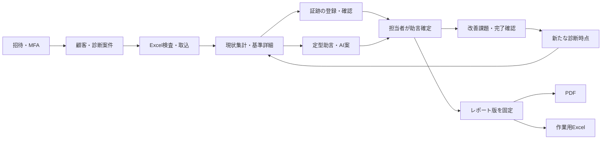

# SCS診断支援 ユースケース

2026-09-18。UIスケッチ確認後の設計。Mustの17ストーリーを8ユースケースに整理する。操作主体は社内担当者。確認担当者は兼任可能、顧客はレポートの受領者でありログインしない。

確認済みの画面構成は [UI_SKETCH.html](UI_SKETCH.html) を参照。証跡確認・課題完了・自己評価は互いに自動更新しない。

## 共通ビジネスルール

| ID | 規則 |
|---|---|
| BR-001 | 初回は制度版2026-03-27の★3、81評価基準/26要求事項。★4追加72件は分母に含めない。制度版ごとにマスターを固定する。 |
| BR-002 | 状態は○/△/✖/未回答。△は半点ではなく判断が微妙な回答。取得確率・公式合否・自動取得判定は出さない。 |
| BR-003 | 元O〜Rと編集値を区別する。Qの既存根拠と今後の作業は人が分離する。空欄・対象外の可能性を勝手に適合へ変えない。 |
| BR-004 | 全データ操作で認証・有効な社内利用者・案件の顧客権限を確認する。管理者全顧客/担当者割当顧客を設計案として採用。 |
| BR-005 | 証跡の添付、証跡確認、作業完了、評価基準の自己評価は独立。変更を連動させない。 |
| BR-006 | AIへは公開要件と担当者確認済みの匿名化回答・不足点だけを送る。証跡本文・元回答・顧客名・内部URLの自動転記は禁止。入力変更後は再確認する。 |
| BR-007 | 助言案は下書き。人が確認した版だけ顧客向け出力へ含め、未確定案を出力前に明示する。 |
| BR-008 | レポートは同一の不変スナップショットからPDFとExcelを生成する。未回答・証跡未確認が残っても件数と項目を明記して出力可能（Q13確定）。 |
| BR-009 | 同時編集は古い版で上書きしない。競合時は最新内容と自分の未保存内容を表示し、再編集する。 |
| BR-010 | 元診断は再診断で上書きしない。制度版/対象範囲が異なる比較には注記し、状態間に勝手な優劣を付けない。 |
| BR-011 | 招待制メール＋パスワード＋MFA。MFA未完了ではデータへのアクセス不可。顧客担当者の氏名入力から招待・通知はしない。 |
| BR-012 | xlsxだけ受け入れる。未知/重複ID・不明自己評価・回答数式は行番号とともにエラー。欠落は明示承認で未回答として補い分母を維持する。 |
| BR-013 | 診断・助言・完了確認の版、操作者、時刻を保持する。初回は保存の履歴情報を備え、自由検索可能な全監査履歴UI（US-020）は追加候補とする。 |
| BR-014 | 顧客データは公開しない。証跡は認可後のダウンロード。外部URLの自動巡回やファイルの自動AI送信はしない。 |
| BR-015 | 対象会社・拠点・部署・システム、診断日、制度版はレポート確定に必須。根拠付き「適用対象外」の認定機能は初回に追加せず、回答の補足へ保留理由を記録する。 |

## UC-001: 顧客と診断案件を管理する

- 対応: US-001、US-002。主アクター: 診断担当者/管理者。副アクター: なし。
- 事前条件: 社内ログイン済み。既存顧客は割当済み。トリガー: 新しい支援案件の開始。
- 事後条件: 顧客・案件が保存され、対象範囲と制度版が確認できる。

正常系:
1. 担当者が顧客一覧を検索する。
2. システムが権限のある顧客だけを表示する。
3. 担当者が新規顧客又は既存顧客を選ぶ。
4. 担当者が案件名、診断日、対象会社/拠点/部署/システムを入力する。
5. システムが★3と参照版を表示して保存する。
6. 担当者が案件ダッシュボードを開く。

代替: 3で新規顧客の場合は作成者を担当者として割り当てる。対象範囲未定でも案件は下書き保存できる。
例外: 他顧客URLは内容を返さない。下書きでは顧客・案件名・制度版を必須とし、未入力・長さ超過を入力箇所に表示する。範囲と診断日はレポート確定時に必須とする。5の競合時は未保存文を維持して再取得する。失敗中の二重押下で案件が重複しない。
適用規則: BR-001、004、009、015。

## UC-002: Excelを検査して取り込む

- 対応: US-003。主アクター: 診断担当者。副アクター: なし。
- 事前条件: 編集権限があり、取込未実施かつ回答の手動編集未実施の診断案件。自動作成された81未回答行は空案件として扱う。トリガー: 一次回答Excelを選択。
- 事後条件: 原値と出典行を保持した81基準の回答が一括反映される。失敗/中止時は変更なし。

正常系:
1. 担当者がxlsxファイルを選ぶ。
2. システムが形式・サイズ・シート・ヘッダー・結合セルを検査する。
3. システムがLのID、Kのレベル、O〜Rの列対応と分類件数を提示する。
4. 担当者が不明記号等を元Excelで修正し、必要なら欠落を未回答で補うことを確認する。
5. システムが★3全81件と除外する★4追加件数を表示する。
6. 担当者が取込確定する。
7. システムが一括保存し、現状ダッシュボードを表示する。

代替: 4で欠落を補わず中止、元ファイルを直して再プレビュー。回答がある案件には別の診断時点の作成を案内する。US-018の現在値へマージする再取込は追加候補。
例外: 暗号化/マクロ/壊れたZIP/制限超過/ID不正/必須列欠落/版違いは確定不可。6で案件が変更されていたら競合を表示して反映しない。ネットワーク再試行は同じ取込識別子で冪等処理。
適用規則: BR-001、003、009、012、013。

## UC-003: 現状と個別評価を確認する

- 対応: US-004、US-005。主アクター: 診断担当者。副アクター: なし。
- 事前条件: 案件閲覧権限。トリガー: 集計又は基準マップの選択。
- 事後条件: 状態別・分類別の状況を把握でき、保存した編集が集計へ反映される。

正常系:
1. 担当者がダッシュボードを開く。
2. システムが81基準の4状態別/分類別件数を表示する。
3. 担当者が対象状態や分類を選ぶ。
4. システムが該当基準の公式文と元O〜R、現在の評価を表示する。
5. 担当者が自己評価、理由、根拠、今後の作業、補足を編集し保存する。根拠の確認状態は証跡画面で独立して更新する。
6. システムが新しい版と更新者を残し件数を更新する。

代替: 5で対象外と思われる場合は補足に理由を記入して要確認の状態を維持する。未取込案件は全81件を未回答で表示する。
例外: 検索一致なしは解除操作を表示。旧版更新は競合表示。入力のHTMLは文字列表示し実行しない。根拠の確認が変わっただけで○へ変更しない。
適用規則: BR-001、002、003、005、009、013、015。

## UC-004: 証跡を登録して確認する

- 対応: US-006、US-007。主アクター: 診断担当者/確認担当者。副アクター: 非公開ファイル保管。
- 事前条件: 案件編集権限。トリガー: 根拠文書を追加。
- 事後条件: 文書名/参照先/該当箇所/関連基準が保存され、確認結果を辿れる。

正常系:
1. 担当者が基準の証跡追加を開く。
2. 担当者が文書名、URL又はファイル、該当箇所を登録する。
3. システムがファイルの種類・サイズを検査し、未確認として記録する。
4. 確認担当者が参照又はダウンロードして内容を確認する。
5. 確認担当者が基準ごとの確認結果・確認メモを保存する。
6. システムが確認者・日時・対象ファイル版を表示する。

代替: 2でファイルなしのURL/文書名だけでも登録できる。URLは自動取得せず担当者が開く。
例外: アップロード中断は未完了表示で参照不可。拡張子偽装/危険形式/容量超過は拒否。別顧客のファイルIDで取得できない。ファイル差替えは新しい証跡として登録し以前の確認を引き継がない。
適用規則: BR-004、005、006、009、013、014。

## UC-005: 助言案を作成して確定する

- 対応: US-008、US-009、US-010。主アクター: 診断担当者/確認担当者。副アクター: 設定済みのAIサービス（任意利用）。
- 事前条件: 案件編集権限。トリガー: 不足/要確認基準の改善策を検討。
- 事後条件: 顧客事情に合わせて人が確認した助言版が保存される。

正常系:
1. 担当者が公式基準と定型助言を開く。
2. システムが不足点・手順・証跡例・完了確認方法を表示する。
3. 担当者が助言を編集する。必要ならAI用に匿名化した状況を別欄へ入力する。
4. AI利用時は担当者が送信全文を確認し、匿名化確認を行って生成する。
5. システムがAI案を下書きとして表示する。
6. 確認担当者が根拠と内容を確認・編集して確定する。
7. システムが確定版・確認者・日時・参照制度版を残す。

代替: 3でAIを使わず定型案/手入力だけで6へ。確定助言がある状態で新しい案を保存しても、既存の確定版は維持する。
例外: AI未設定/失敗/タイムアウトは下書きを失わず手動へ戻る。4以降に送信文を変えた場合は確認を無効化。AIの指示・リンク・HTMLは操作命令として実行しない。自己評価・理由・根拠・今後の作業・補足、又は関連証跡/確認状態が変われば当該基準の助言を再確認対象とし、再確定まで新規レポートに出力しない。対象範囲変更は全基準を再確認対象とする。課題の担当/期限/進捗だけの変更は助言の再確認を要求しない。過去のスナップショットは変えない。
適用規則: BR-002、006、007、009、013、014。

## UC-006: 改善課題と再診断を管理する

- 対応: US-011、US-012、US-013。主アクター: 診断担当者/確認担当者。副アクター: なし。
- 事前条件: 案件編集権限。トリガー: 対策への着手、又は再診断開始。
- 事後条件: 担当/期限/進捗と完了確認が保存され、過去を保持した比較ができる。

正常系:
1. 担当者が基準と関連付けた課題を登録する。
2. 担当者が担当者名、期限、完了条件を入力する。
3. 担当者が進捗を更新し、作業結果を完了確認待ちにする。
4. 確認担当者が結果と証跡を確認し、確認済又は差戻しを記録する。
5. 再診断時、担当者が前回と対象範囲・制度版を確認して新規診断を作る。
6. システムが前回を維持して今回の入力を用意する。
7. 担当者が今回の評価を保存して前回と比較する。

代替: 前回からの回答を参考としてコピー又は空で開始。コピーされた証跡・助言の確認は解除して再確認。課題は任意選択して引継ぎ、完了確認を初期化する。
例外: 無効な期限/空担当は該当入力に表示。未完了条件で確認済にできない。課題完了から自己評価は変わらない。異なる顧客は比較できない。対象範囲/版違いでは対応不能の基準を別表示する。
適用規則: BR-002、005、009、010、011、013。

## UC-007: レポートを確定して出力する

- 対応: US-014、US-015、US-016。主アクター: 診断担当者。副アクター: なし。
- 事前条件: 閲覧権限と診断範囲・診断日の入力。トリガー: 顧客報告準備。
- 事後条件: 同一時点のサマリーと全基準詳細をPDF/Excelで保存できる。

正常系:
1. 担当者がレポートプレビューを開く。
2. システムが範囲、参照版、件数、主要課題、全81基準、確定助言を表示する。
3. システムが未回答・証跡未確認・助言未確定を一覧で示す。
4. 担当者が内容を確認してレポート版を確定する。
5. システムが不変スナップショットを作成する。
6. 担当者がPDFと作業用Excelをそれぞれ保存する。

代替: 3で未回答等が残っても件数・項目を明記したまま4へ進める（Q13）。修正後の報告は新たなレポート版を作る。以前の版を再出力できる。
例外: 4までに診断が変わったら再プレビュー。範囲未入力は確定不可。生成が中断しても同じsnapshotで再生成可能。未確定案/再確認が必要な助言は本文へ入れず空欄理由を表示。自由記述をExcel数式にしない。
適用規則: BR-002、004、007、008、009、013、015。

## UC-008: 招待と多要素認証で利用する

- 対応: US-017。主アクター: 管理者/招待された社内担当者。副アクター: 認証基盤。
- 事前条件: 管理者はログイン済み。トリガー: 社内担当者の追加/ログイン。
- 事後条件: MFA完了した有効利用者が割当顧客へアクセスできる。

正常系:
1. 管理者が社内メール、役割、割当顧客を登録する。
2. システムが有効期限付き招待を発行する。
3. 社内担当者が招待を受け、パスワードとMFAを設定する。
4. 担当者がメールとパスワードで認証する。
5. 担当者がMFAを完了する。
6. システムが有効な利用者状態と割当を確認して一覧を表示する。

代替: 管理者は割当変更/アカウント停止を行う。招待期限切れは再発行。MFA端末紛失は本人確認した運用管理者が認証基盤の回復手順を実施する。初回管理者は公開登録で作らない。
例外: 未招待/無効/期限切れ/MFA未完了はデータ取得不可。停止/割当解除は既存token保持中でもAPIで拒否。認証基盤が使えない場合は迂回ログインせず再試行案内。
適用規則: BR-004、011、013、014。

## 追跡表

| UC | US | 機能設計（作成済み） |
|---|---|---|
| UC-001 | 001,002 | cases.md |
| UC-002 | 003 | imports.md |
| UC-003 | 004,005 | assessments.md |
| UC-004 | 006,007 | evidence.md |
| UC-005 | 008,009,010 | advice.md |
| UC-006 | 011,012,013 | improvement.md |
| UC-007 | 014,015,016 | reports.md |
| UC-008 | 017 | access.md |

US-018〜020は初回必須に追加しない。元データ保全と更新者記録はMustを満たすための内部基盤として含める。

## レビュー記録

2026-09-18: 独立レビューでhighなし。下書き必須項目と出力必須項目の区別、空案件の定義、自己評価の編集、確定助言の再確認条件を追記。対応するPoCにも原値の列対応、長文の末尾、助言再確認の検査を追加した。
